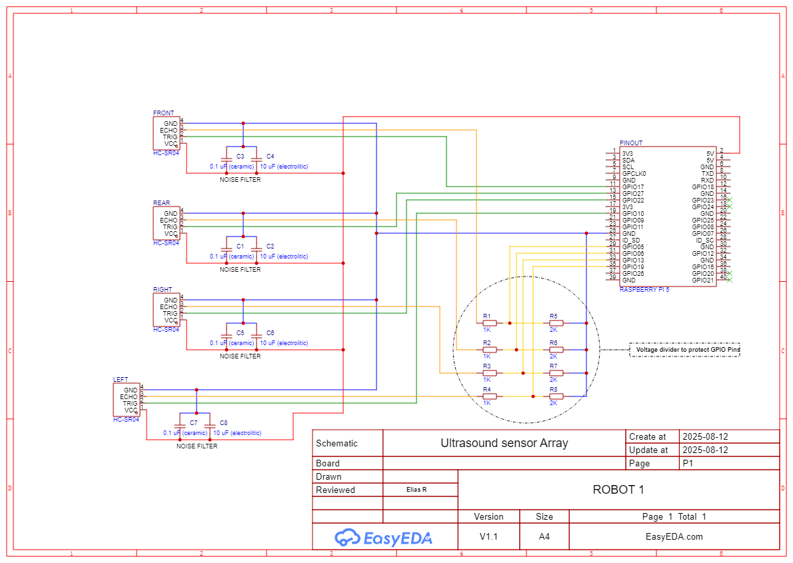
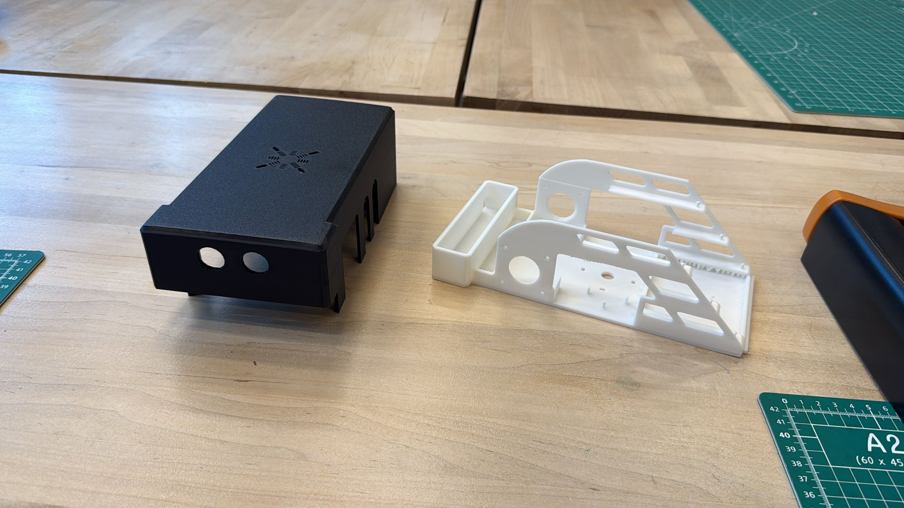

# Autonomous Mobile Robot

   
  <em>Fig. 1 Robot asselbly.</em>

I designed this robot as part of a larger project focused on computer vision for a startup team. They required an autonomous robot capable of navigating an environment (for example, a store) and able to clean spills or debris. The team also requested a mapping capability so that the robot could remember its environment.

This robot was entirely 3D-printed, from the frame to the tires. It also featured an array of ultrasonic sensors which, coupled with LiDAR and accelerometer sensors, enabled it to create a map of its environment. This environment was shared with a computer vision system capable of detecting spills. Once a spill was detected, the robot would navigate toward the target. After the task was completed, the robot returned to its base.

   
  <em>Fig. 2 Robot internal components.</em>

This robot required precise command and control while operating with limited computing capability. I configured the system so that a Raspberry Pi served as the main controller, responsible for acquiring data from the LiDAR and ultrasonic sensors and communicating with an Arduino Nano that controlled the robot’s movement. Since the robot was autonomous, it also needed to be untethered and was therefore fitted with a battery.

   
  <em>Fig. 3 ultrasound array circuitry.</em>

In this setup, the battery powered an electrical bus that distributed a common voltage to all parts of the robot. Buck converters were then used to step the voltage down to the required levels for each subsystem. This was challenging because the Raspberry Pi, Arduino Nanos, and stepper drivers all operate at different voltages while still needing to share a common ground for SDA–SCL communication.

   
  <em>Fig. 4 stepper driver circuits.</em>

   
  <em>Fig. 5 3D printed chassis component.</em>

This project successfully integrated mechanical design, sensing, and embedded control to create an autonomous mobile robot capable of mapping its environment and responding to detected spills. Despite limitations in computing power and power management, the system operated reliably through careful hardware and control design.
